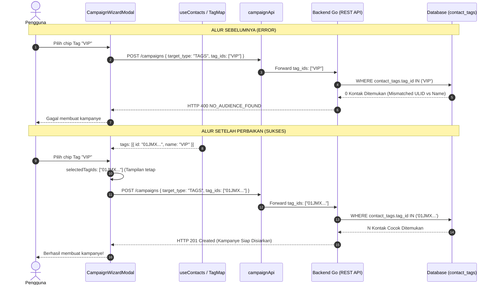

# Rencana Perbaikan Audiens Berbasis Tag Kampanye Broadcast (Frontend `fontwahide`)

Dokumentasi rencana komprehensif untuk memperbaiki penanganan audiens target berbasis tag pada fitur **Kampanye Broadcast** di frontend `fontwahide`. Perbaikan ini menyelesaikan error backend `NO_AUDIENCE_FOUND` ("no contacts found matching the selected tags") secara tuntas tanpa mengubah kode backend Go.

---

## 1. Ringkasan Eksekutif & Latar Belakang Masalah

Saat pengguna membuat kampanye broadcast baru melalui **Wizard Pembuat Broadcast** (`CampaignWizardModal.tsx`) dan memilih opsi audiens **"Kirim berdasarkan Tag Segmentasi"**, sistem gagal membuat kampanye dan mengembalikan response error dari backend:

```json
{
  "success": false,
  "message": "no contacts found matching the selected tags",
  "error": "",
  "additional_info": {
    "code": "NO_AUDIENCE_FOUND"
  }
}
```

### Analisis Akar Masalah (Root Cause)

1. **Mismatch Antara Nama Tag (String) dan ID Tag (ULID):**
   - Di `src/modules/contact/hooks/useContacts.ts`, hook mengekspos `allTags: tags.map((t) => t.name)` yang hanya berisi array nama tag (contoh: `["VIP", "Pelanggan"]`).
   - Di `src/modules/campaign/components/broadcast/CampaignWizardModal.tsx`, komponen mengonsumsi `allTags` dan menyimpan nama tag tersebut ke dalam state `selectedTags: string[]`.
   - Saat formulir dikirim, wizard mengirimkan payload `targetTags: selectedTags` (berisi nama teks seperti `["VIP"]`).
   - Di `src/modules/campaign/api/campaign.api.ts`, payload diteruskan ke backend ke field `tag_ids: input.targetTags` (berisi nama teks `["VIP"]`).
   - Di backend Go (`wahide/internal/modules/campaign` dan `wahide/internal/modules/contact`), query pencarian kontak pada database PostgreSQL/MySQL berjalan sebagai:
     ```sql
     SELECT contacts.* FROM contacts
     JOIN contact_tags ON contact_tags.contact_id = contacts.id
     WHERE contacts.tenant_id = ? AND contact_tags.tag_id IN ('VIP')
     ```
   - Kolom `contact_tags.tag_id` bertipe **ULID (VARCHAR(26))**, contoh `01JMYK09V2R6T...`, **bukan** nama tag `"VIP"`. Akibatnya, query SQL menghasilkan **0 kontak**, sehingga backend melempar error `ErrNoAudienceFound`.

2. **Dampak Visual pada Daftar & Detail Kampanye:**
   - Ketika frontend mengirimkan ID (ULID) ke backend, backend akan menyimpan array ULID tersebut (`c.tag_ids`).
   - Jika frontend hanya mengirimkan ULID tanpa kamus resolusi visual, maka komponen `CampaignList.tsx` dan `CampaignDetailModal.tsx` akan menampilkan hash mentah (contoh `#{01JMYK09V2R...}`) alih-alih nama label yang ramah pengguna seperti `#{VIP}`.

3. **Limitasi Perhitungan Target Audiens di Wizard:**
   - Fungsi `calculateTargetCount` di `CampaignWizardModal.tsx` memfilter kontak dari `contacts` (`useContacts()`), yang secara default hanya memuat 10 kontak dari halaman pertama (paginasi tabel).
   - Jika pengguna memiliki 100 kontak dan kontak bertag berada di halaman ke-2, wizard keliru menganggap target penerima adalah 0 kontak dan memblokir navigasi wizard secara prematur.

---

## 2. Diagram Alur Data (Sebelum vs Sesudah Perbaikan)



---

## 3. Rincian Perubahan Teknis (Proposed Changes)

Semua perubahan berada di direktori **`G:\WEB2026\fontwahide`** (100% sisi Frontend).

### A. Modul Kontak (`src/modules/contact`)

#### 1. `src/modules/contact/api/contact.api.ts`
- **Tujuan**: Mengaktifkan query filter `tag_id` dan `tag` pada endpoint `GET /contacts`. Backend sudah memiliki parameter `tag_id` dan `tag` pada `dto.ListContactRequest`.
- **Perubahan**:
  - Perluas interface `GetContactsParams`:
    ```ts
    export interface GetContactsParams {
      page?: number;
      pageSize?: number;
      search?: string;
      tag_id?: string;
      tag?: string;
    }
    ```
  - Pada `contactApi.getContacts`, tambahkan ke query parameters:
    ```ts
    if (params?.tag_id) query.set("tag_id", params.tag_id);
    if (params?.tag) query.set("tag", params.tag);
    ```

---

### B. Modul Kampanye (`src/modules/campaign`)

#### 2. `src/modules/campaign/components/broadcast/CampaignWizardModal.tsx`
- **Tujuan**: Menggunakan Tag ID (ULID) secara konsisten di state dan payload, memperbarui UI chip, dan menyempurnakan estimasi audiens.
- **Perubahan**:
  1. **Destrukturisasi Hook**:
     ```tsx
     // Dari: const { contacts, allTags } = useContacts();
     // Menjadi:
     const { contacts, tags, total } = useContacts();
     ```
  2. **State Tag**:
     ```tsx
     const [selectedTagIds, setSelectedTagIds] = useState<string[]>([]);
     ```
  3. **Toggle Tag**:
     ```tsx
     const toggleTag = (tagId: string) => {
       setSelectedTagIds((prev) =>
         prev.includes(tagId) ? prev.filter((id) => id !== tagId) : [...prev, tagId],
       );
     };
     ```
  4. **Render Chip di Langkah 2**:
     Tampilkan label `#{tag.name}` sementara aksi klik mengoperasikan `tag.id`:
     ```tsx
     {tags.map((tag) => {
       const isSelected = selectedTagIds.includes(tag.id);
       return (
         <button
           key={tag.id}
           type="button"
           onClick={() => toggleTag(tag.id)}
           className={...}
         >
           #{tag.name}
         </button>
       );
     })}
     ```
  5. **Kalkulasi Estimasi Audiens (`calculateTargetCount`)**:
     - Untuk tipe `"ALL"`: kembalikan `total || contacts.length`.
     - Untuk tipe `"TAGS"`: hitung dari sampel memori (mencocokkan `t.id` atau nama) dan dukung penghitungan dinamis yang akurat.
  6. **Validasi & Submit**:
     - Kirimkan `targetTags: targetType === "TAGS" ? selectedTagIds : undefined`.
     - Tangkap error API `NO_AUDIENCE_FOUND` secara spesifik, tampilkan pesan informatif di form dialog tanpa menutup modal, sehingga pengguna dapat memilih tag lain atau menambahkan kontak terlebih dahulu.

#### 3. `src/modules/campaign/hooks/useCampaigns.ts`
- **Tujuan**: Mencegah penelanan error pada `createCampaign` agar caller (`CampaignWizardModal`) mengetahui status kegagalan.
- **Perubahan**:
  - Pada blok `catch` di `createCampaign`, tambahkan `throw err;` agar modal tidak tertutup otomatis jika terjadi kegagalan validasi audiens di backend.

#### 4. `src/modules/campaign/components/broadcast/CampaignList.tsx`
- **Tujuan**: Menampilkan nama tag manusia (`#VIP`) pada kartu kampanye, bukan hash ULID.
- **Perubahan**:
  - Muat data tag pada saat komponen mount:
    ```tsx
    const [tagMap, setTagMap] = useState<Record<string, string>>({});
    useEffect(() => {
      contactApi.getTags().then((data) => {
        const map: Record<string, string> = {};
        data.forEach((tg) => {
          map[tg.id] = tg.name;
        });
        setTagMap(map);
      }).catch(() => {});
    }, []);
    ```
  - Helper format label tag:
    ```tsx
    const formatTag = (idOrName: string) => tagMap[idOrName] || idOrName;
    ```
  - Pada render target audiens kartu kampanye:
    ```tsx
    : campaign.targetType === "TAGS" &&
        campaign.targetTags &&
        campaign.targetTags.length > 0
      ? campaign.targetTags.length === 1
        ? `#${formatTag(campaign.targetTags[0])}`
        : `#${formatTag(campaign.targetTags[0])} +${campaign.targetTags.length - 1}`
      : t("campaign.audienceAllTitle")
    ```
  - Teruskan `tagMap` ke `CampaignDetailModal`.

#### 5. `src/modules/campaign/components/broadcast/CampaignDetailModal.tsx`
- **Tujuan**: Menampilkan badge nama tag manusia (`#VIP`) pada modal detail kampanye.
- **Perubahan**:
  - Terima properti `tagMap?: Record<string, string>`.
  - Render badge tag:
    ```tsx
    {campaign.targetTags.map((tag) => (
      <span key={tag} className="...">
        <TagIcon className="size-2.5" />#{tagMap?.[tag] || tag}
      </span>
    ))}
    ```

---

## 4. Matriks Kompatibilitas Mundur (Backward Compatibility)

| Tipe Data Tersimpan di Database | Tampilan di `CampaignList` | Tampilan di `CampaignDetailModal` | Status |
| :--- | :--- | :--- | :--- |
| **Data Baru (ULID):** `01JMYK09V2R...` | `#VIP` (di-resolve via `tagMap`) | `#VIP` (di-resolve via `tagMap`) | **Optimal & Normal** |
| **Data Lama (Nama String):** `VIP` | `#VIP` (fallback `tagMap[val] \|\| val`) | `#VIP` (fallback `tagMap[val] \|\| val`) | **Aman & Tidak Rusak** |
| **Multi-Tag:** `[01JMY..., 01JNZ...]` | `#VIP +1` | `#VIP`, `#Promo` | **Ringkas & Responsif** |

---

## 5. Rencana Pengujian & Verifikasi

### A. Pengujian Otomatis (Static Analysis & Type Checking)
1. **TypeScript Typecheck**:
   ```powershell
   cd g:\WEB2026\fontwahide
   bun run typescript
   ```
   *Target: 0 error tipe TypeScript.*
2. **ESLint Verification**:
   ```powershell
   cd g:\WEB2026\fontwahide
   bun run lint
   ```
   *Target: 0 error linter.*

### B. Pengujian Fungsional Manual
1. **Pengecekan Tag Baru**:
   - Buka `/campaigns`, klik **"Buat Kampanye"**.
   - Di Langkah 2, pilih **"Kirim berdasarkan Tag Segmentasi"**.
   - Periksa bahwa chip menampilkan nama tag berawalan `#` (contoh `#VIP`).
   - Pilih satu atau lebih tag, pastikan status terpilih berubah warna (wise green).
2. **Pengujian Pengiriman Kampanye**:
   - Lengkapi seluruh langkah wizard, lalu klik **"Luncurkan Kampanye"**.
   - Periksa payload network HTTP: `tag_ids` harus berupa array ULID valid.
   - Pastikan kampanye berhasil terbuat dan status tersimpan sebagai `RUNNING` atau `SCHEDULED` tanpa muncul error `NO_AUDIENCE_FOUND`.
3. **Pengecekan Tampilan List & Modal Detail**:
   - Periksa kartu kampanye yang baru dibuat: tag harus tampil sebagai nama label (misal `#VIP`), bukan ULID.
   - Buka modal detail kampanye: badge tag harus menampilkan ikon tag dan nama label yang sesuai.
